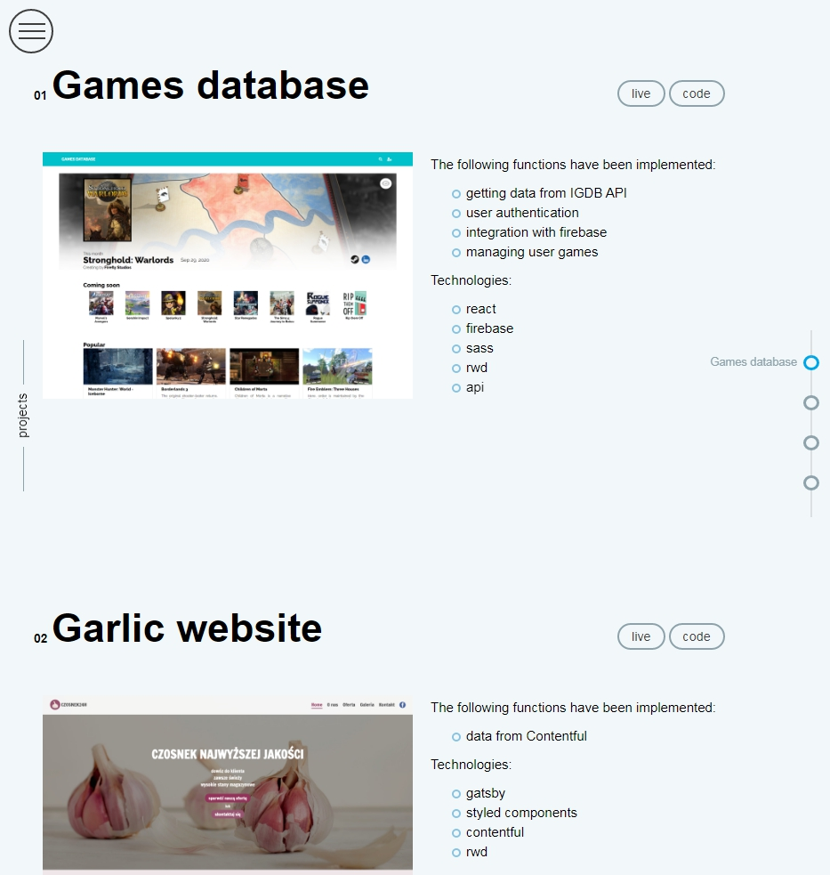

# Portfolio
Personal portfolio containing several larger projects

[live](https://mb2-portfolio.netlify.app/)

## Screenshot

## Technologies
* HTML
* CSS
* JS
* React

## Setup
After you clone this repo to your desktop, go to its root directory and run npm install to install its dependencies.

Once the dependencies are installed, you can run npm start to start the application. You will then be able to access it at localhost:3000

## License
[MIT](https://choosealicense.com/licenses/mit/)
